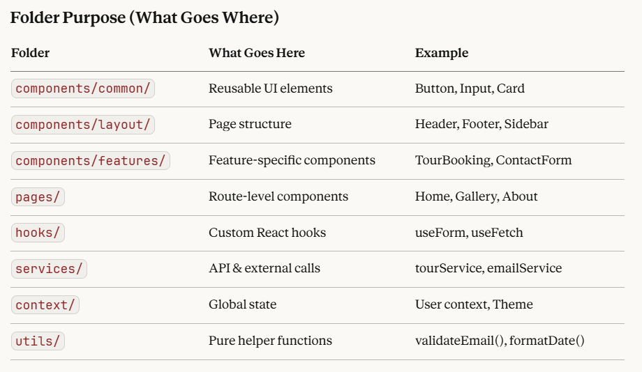

# roxboro-medical-office-react
Modern React application for Roxboro Medical Office - A professional medical office leasing platform featuring property listings, tour scheduling, and contact management. Built with React, React Router, and CSS Modules following enterprise-level architecture patterns.

 **Note:** This is an educational portfolio project built from scratch to demonstrate React development skills and modern frontend architecture. Not affiliated with any official medical office.

 ## 🎯 Project Overview

A comprehensive medical office leasing platform featuring property listings, interactive tour scheduling, detailed property information, and contact management. Built with React to showcase modern web development practices and clean architecture principles.

### Live Demo
🚧 *Coming Soon* - Currently in development

## ✨ Features

### Current Features
- ✅ Responsive navigation header
- ✅ Hero section with background imagery
- ✅ Reusable component library (Button, Input, Card)
- ✅ CSS Modules for scoped styling
- ✅ Clean folder structure

### Planned Features
- 🔄 Interactive tour booking form with validation
- 🔄 Property details page with image gallery
- 🔄 FAQ accordion component
- 🔄 Contact form with email integration
- 🔄 Multi-page routing with React Router
- 🔄 Proximity/location map integration
- 🔄 Responsive mobile design
- 🔄 Loading states and error handling
- 🔄 Form validation and user feedback
- 🔄 Custom React hooks for reusable logic

## 🛠️ Tech Stack

### Core Technologies
- **React 19** - UI library with hooks
- **React Router** - Client-side routing
- **CSS Modules** - Scoped component styling
- **JavaScript ES6+** - Modern JavaScript features

### Development Tools
- **Vite** - Build tooling and configuration
- **Git** - Version control
- **npm** - Package management

### Future Additions
- TypeScript (planned)
- React Testing Library (planned)
- ESLint & Prettier (planned)

**⭐ If you found this project helpful, please consider giving it a star!**

## 📂 Project Architecture

Available in the source code

